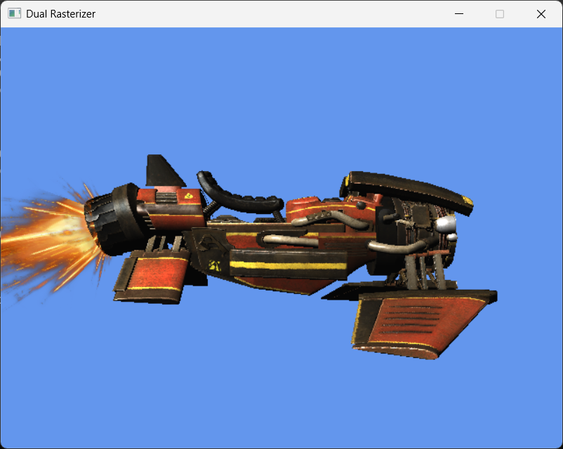
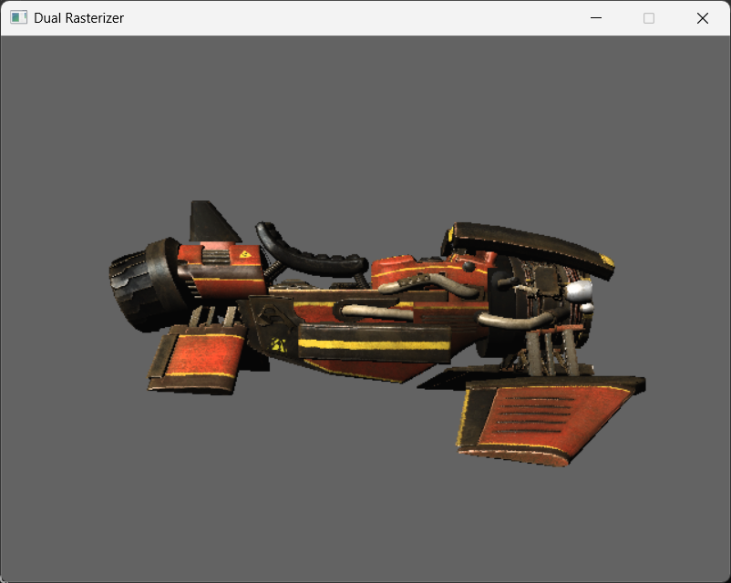

# Dual Rasterizer
A simple hardware & software rasterizer. Yes, both! You can switch live between hardware rasterization (GPU) and software rasterization (my own implementation, and likely somewhat flawed calculations).

The idea was to have a seamless switch between hardware and software rasterization without any significant visual differences (besides the background and the particle).

## Screenshots
While I can show the results of both hardware & software rasterizers, the lack of difference between them is truly noticeable when actually running the project and pressing f1 to switch.

### Hardware result

### Software result

## Building
On windows, make sure you have VS installed with the C++ development toolchain and CMake support. Open the project by right clicking in the project root directory and opening it with Visual Studio, then you can select your build configuration and build in Visual Studio.

## Running
When running the project, the controls are displayed in the console along with the FPS.